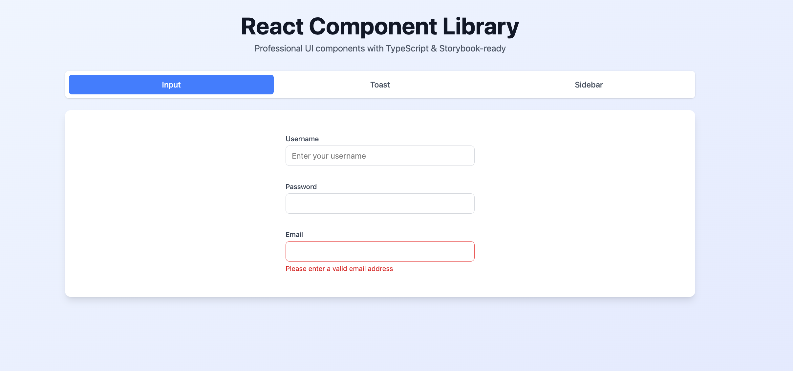
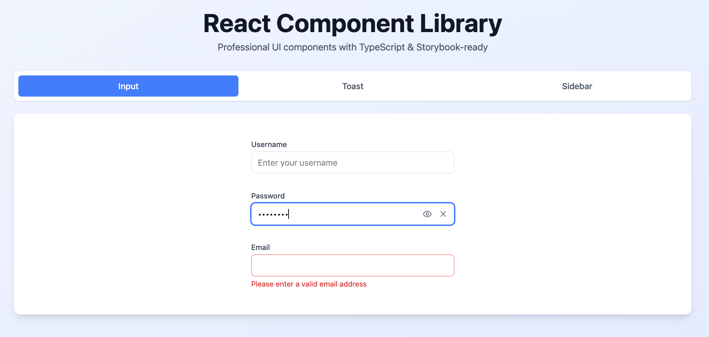
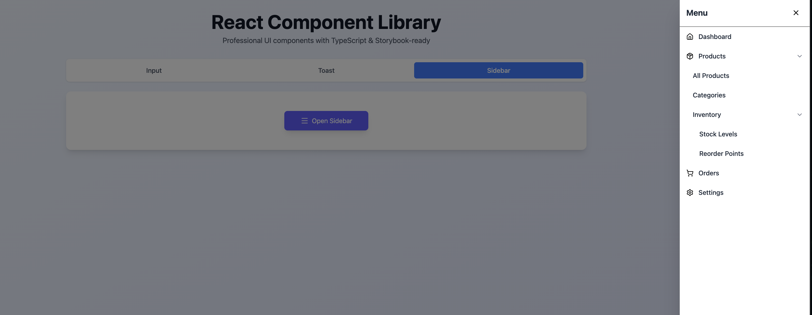

# React Component Library

A professional UI component library built with **React**, **TypeScript**, and **Tailwind CSS**. This project features interactive documentation powered by **Storybook** and a comprehensive demonstration page showcasing all implemented components.

## 🚀 Live Preview

You can view the deployed version of the project here:

---

## 📦 Components

The library includes three core components developed from scratch:

* **Input**: A smart input field supporting multiple types (password, email, number), a password visibility toggle, and a clearable functionality.
* **Toast**: A notification system featuring auto-dismiss, smooth transitions, and multiple variants (success, error, warning, info).
* **Sidebar Menu**: A sliding navigation menu with support for multi-level nested submenus and a functional backdrop.

---

## 🛠 Tech Stack

* **React 18** (Next.js App Router)
* **TypeScript** for strict type safety
* **Tailwind CSS v4** for modern utility-first styling
* **Storybook 10** for component documentation and isolated testing
* **Lucide React** for a consistent icon system

---

## 🚀 Getting Started

Follow these steps to get a local copy up and running.

### Prerequisites

Ensure you have **Node.js** and **npm** (or yarn) installed on your machine.

### Installation & Running

1. **Clone the repository:**
```bash
git clone https://github.com/your-username/react-component-library.git

```


2. **Navigate to the project directory:**
```bash
cd react-component-library

```


3. **Install NPM packages:**
```bash
npm install

```


4. **Start the Development Server (Next.js):**
```bash
npm run dev

```

5. **Start Storybook:**
```bash
npm run storybook

```

---

## 📸 Screenshots

### 1. Input Component



### 2. Toast Notifications


### 3. Sidebar Menu



### 4. Storybook Dashboard


---

## 📁 Project Structure

```text
src/
├── app/              # Next.js App Router (Demo Page)
├── components/       # Component source code
│   ├── Input/        # Input logic, styles, and stories
│   ├── SidebarMenu/  # Sidebar logic, styles, and stories
│   └── Toast/        # Toast logic, styles, and stories
├── constants/        # Configuration and static data
├── types/            # Shared TypeScript interfaces
└── index.ts          # Public library API